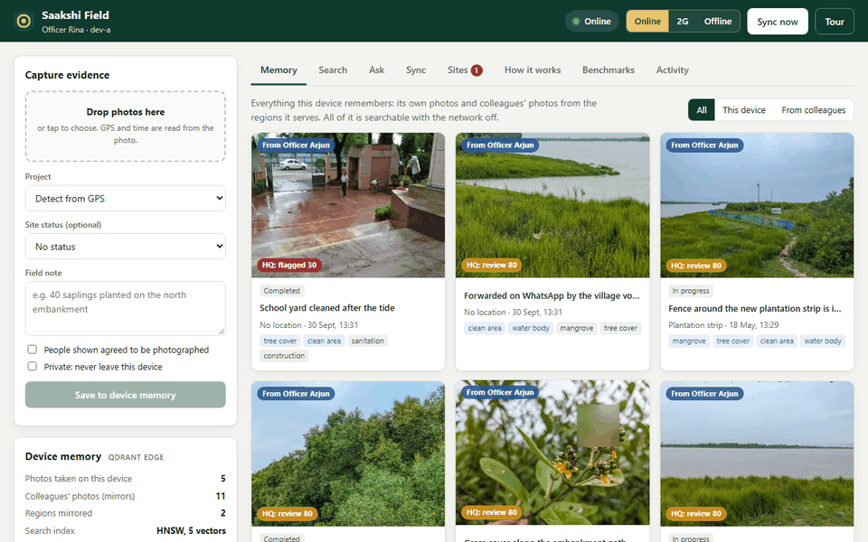
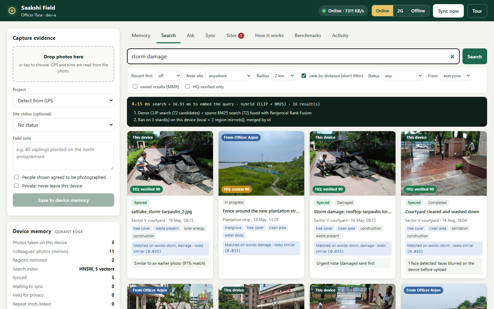
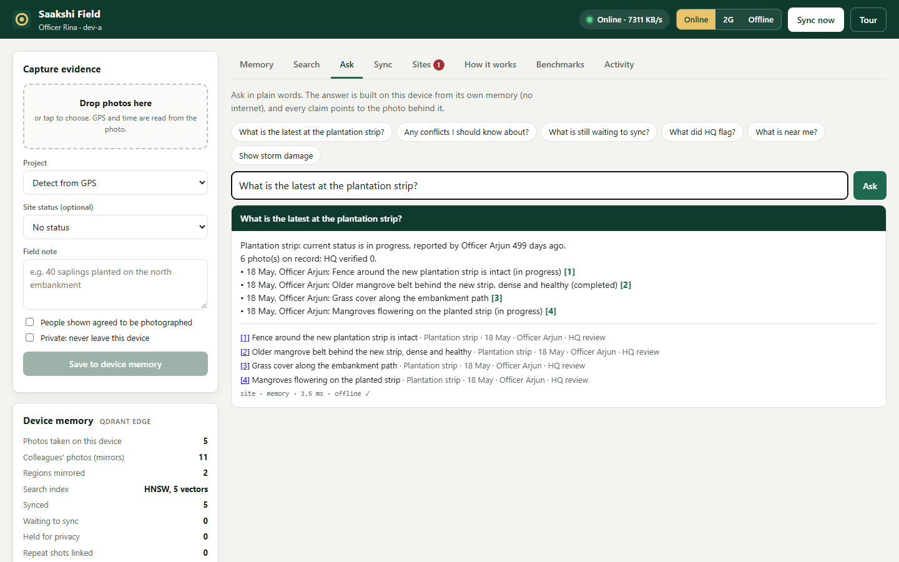
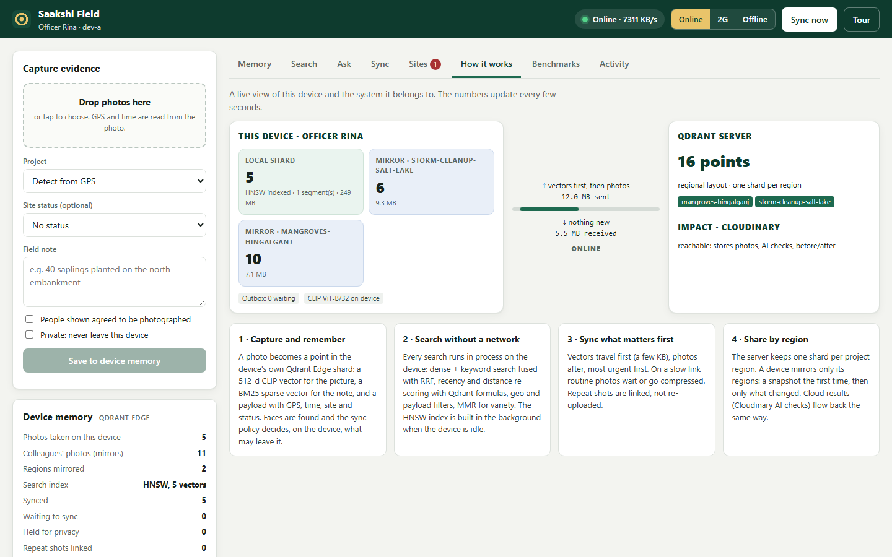
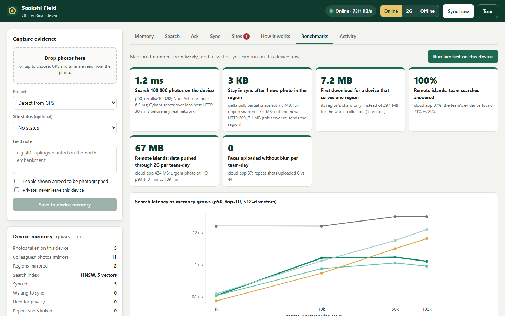
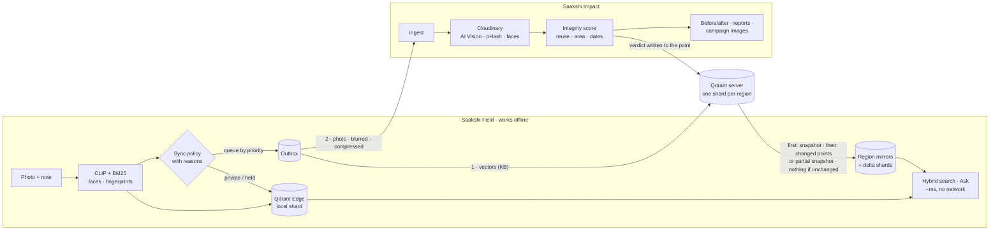
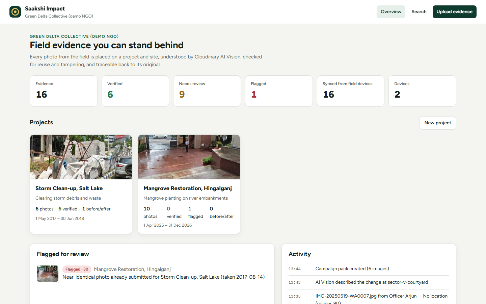
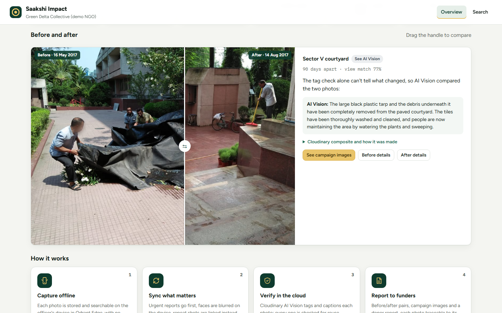
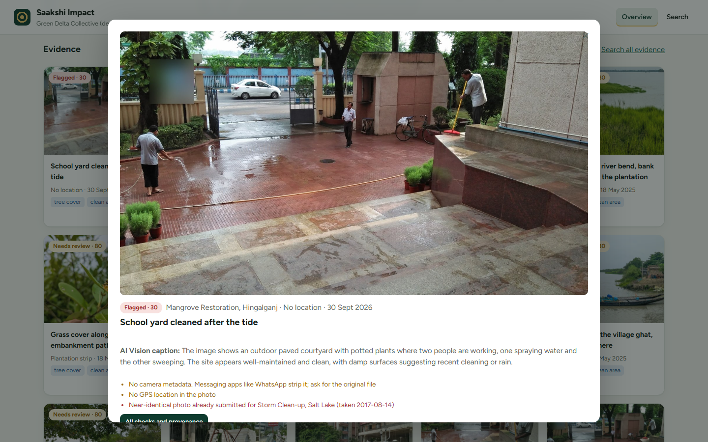
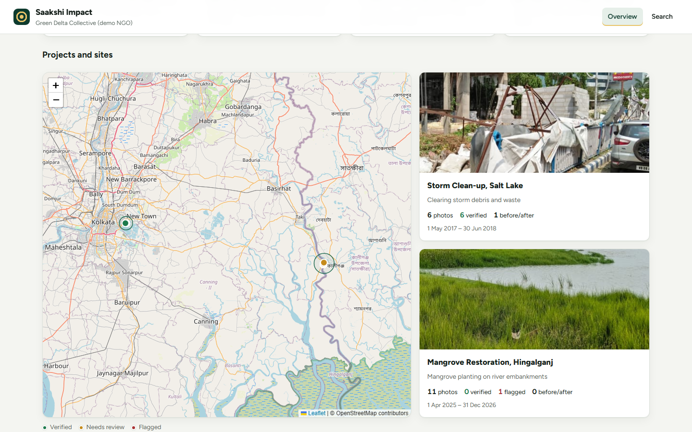

# Saakshi (PS03)

**Field evidence that works with no signal, syncs what matters first, and can be verified.**

[](https://github.com/rishighosal/saakshi/actions/workflows/ci.yml)


*Saakshi* (साक्षी / সাক্ষী) means **witness**.

**Live demo: [saakshi-impact.onrender.com](https://saakshi-impact.onrender.com)**, the NGO office dashboard (read-only; the first visit after a quiet spell takes about a minute to wake up). The field app runs on the officer's device: [run it yourself](#run-it) in a few minutes.

NGO and CSR field teams prove their work with photos: embankments planted, ponds cleaned, drains unblocked. The photos are taken where the network is weak or gone, and they decide wages, grants and trust. Today they pile up in phone galleries and WhatsApp groups that strip their location, nobody in the field can search what a colleague already reported, an urgent "the embankment is breached" photo waits behind forty routine ones, and a photo reused from another project looks exactly like new evidence.

Saakshi is one system in two parts:

| | **Saakshi Field** · the edge app | **Saakshi Impact** · the cloud app |
|---|---|---|
| Runs on | an officer's laptop, or a field kit that officers' phones connect to | the NGO office, in the cloud |
| Built on | **Qdrant Edge** (in-process vector memory), CLIP and BM25 on the device, OpenCV | **Cloudinary** (storage, AI Vision, transformations), Qdrant server |
| Problem statement | **PS03 · AI-Powered Edge Memory & Intelligence Platform** | **PS02 · AI-Powered Impact & Sustainability Media Platform** |

<p align="center">
  
</p>
<p align="center"><sub>Sample data: real, openly licensed photos from Wikimedia Commons (<a href="docs/PHOTOS.md">credits</a>); the organisation, projects and notes are fictional.</sub></p>

<p align="center">
  
  
  
  
</p>

## The problem, with evidence

* **The network fails where the work happens.** 2.2 billion people are offline; 85% of urban vs 58% of rural people use the internet ([ITU 2025](https://www.itu.int/en/mediacentre/Pages/PR-2025-11-17-Facts-and-Figures.aspx)). 350 million live with no mobile internet coverage at all, mostly in rural and island areas ([GSMA](https://www.gsma.com/newsroom/press-release/new-gsma-report-shows-mobile-internet-connectivity-continues-to-grow-globally-but-barriers-for-3-45-billion-unconnected-people-remain/)). Cyclone Remal took more than 10,000 towers off air across the Sundarbans delta ([The Daily Star](https://www.thedailystar.net/business/news/cyclone-disrupts-10000-telecom-towers-millions-out-service-3620101)).
* **Photo evidence already decides pay and funding, and it breaks.** India's rural jobs scheme requires two geotagged photos of workers a day; a parliamentary panel found its success depends on "proper internet connectivity" ([Business Standard](https://www.business-standard.com/india-news/parl-panel-urges-govt-to-review-use-of-nmms-app-for-attendance-issues-123072701158_1.html)), and irrelevant photos of fields and trees have been accepted as attendance ([The Wire](https://m.thewire.in/article/labour/nmms-didnt-end-corruption-in-mgnrega-it-changed-its-shape-and-locked-workers-out)).
* **Impact claims must be verifiable.** Indian companies spent ₹34,909 crore on CSR in FY24 and large projects need independent impact assessment ([CSR Journal](https://thecsrjournal.in/india-inc-spent-rs-34908-75-crore-on-csr-in-fy24-national-csr-portal/), [CSR Rules 2021](https://cleartax.in/s/csr-amendment-rules-2021)); unverified claims fail, like the >90% of rainforest offsets found likely to be "phantom" ([Carbon Brief](https://www.carbonbrief.org/daily-brief/revealed-more-than-90-of-rainforest-carbon-offsets-by-biggest-provider-are-worthless-analysis-shows/)).
* **Photos of people are personal data**, now under India's DPDP Rules 2025 ([India Briefing](https://www.india-briefing.com/news/dpdp-rules-2025-india-data-protection-law-compliance-40769.html/)).

Full sources and how each feature answers them: **[docs/WHY.md](docs/WHY.md)**.

## Measured, not claimed

From the benchmark suite in [`bench/`](bench) (method, all tables and caveats: **[docs/BENCHMARKS.md](docs/BENCHMARKS.md)**; you can re-run it, and the device's Benchmarks tab runs a live test). Search and the field day ran on a Windows laptop; sync ran from that laptop against a Qdrant Cloud cluster, as it is deployed. Each result file records its machine.

| | Saakshi | Compared with |
|---|---|---|
| Search 100,000 photos on the device (a Windows laptop) | **1.2 ms** p50, recall@10 0.985 | NumPy brute force 6.3 ms; Qdrant server over HTTP on *localhost* 30.7 ms; offline: no answer |
| Stay in sync after 1 new photo in the region (Qdrant Cloud) | **3 KB** (delta pull) | partial snapshot 7.3 MB (Qdrant Cloud re-sends the region); re-download 7.5 MB |
| First download for a device serving 1 of 5 regions | **7.2 MB** | 29.4 MB for the whole collection |
| Simulated day on remote islands (65% offline): searches answered | **100%** | cloud app 37% |
| … share of the team's evidence an officer finds | **71%** | cloud app 29%, offline queue app 45% |
| … data pushed through 2G per team-day | **67 MB** | 434 MB |
| … urgent photo reaches HQ, 90th percentile | **110 min** | 189 min |
| Unblurred faces / repeat shots uploaded per team-day | **0 / 0** | 37 / 44 |

Where Saakshi is *not* faster: up to 10,000 photos a plain NumPy matrix searches quicker (0.5 ms against 1.6 ms at 10,000); the index wins from 50,000 photos. We keep Qdrant Edge for the filters, hybrid search, persistence and, above all, **sync in the server's own shard format**. The field day is a simulation with stated assumptions; the policy code in it is the production code.

## How it works



1. **Capture offline.** GPS and time come from the photo; it is placed on a project and site, faces are detected, and it becomes a point in the device's Qdrant Edge shard (CLIP image vector, BM25 vector of the note, payload). Searchable immediately, network or not.
2. **Search and ask offline.** Dense + keyword search fused with RRF, recency and distance re-scoring (Qdrant formulas), geo and payload filters, MMR for variety, across the device's own shard and its region mirrors. **Ask** answers questions like "what is the latest at the plantation strip?" from that memory, citing each photo.
3. **Decide what leaves, and say why.** Private items never leave; faces without consent leave only blurred; repeat shots are linked; urgent reports jump the queue; on a measured slow link routine photos wait or go compressed. Vectors (a few KB) always go first.
4. **Sync by region.** The server keeps one shard per project region (custom sharding). Devices mirror only their regions: a snapshot the first time, then just the changed points, or a partial snapshot when many changed; nothing when nothing changed.
5. **Verify in the cloud, and bring the verdict back.** Cloudinary AI Vision tags and captions each photo; it is checked against every earlier submission, the project area and dates. The verdict is written into the shared point and reaches the officer's device, and colleagues' devices, on the next pull.

## PS03 · Qdrant Edge: what the brief asks, what Saakshi does

| The brief asks for | Saakshi Field | Proof |
|---|---|---|
| Searchable semantic memory on the device | Qdrant Edge local shard + one mirror per region + delta shards; CLIP (512-d) + BM25 sparse; payload, float and geo indexes; HNSW tuned and built in the background | [deep dive §1](docs/PS03_DEEP_DIVE.md#1-memory-on-the-device) |
| Low-latency vector and hybrid search offline | RRF fusion, formula re-scoring (recency, distance), geo filter, MMR, recommend; query plan shown in the UI; Ask with citations | 1.2 ms at 100k photos |
| Decide what stays local and what syncs | per-item policy with reasons; link-aware sending; storage budget; region subscriptions | [policy tests](tests/test_policy.py) |
| Intermittent connectivity | persistent outbox with backoff; Online / 2G / Offline switch; link monitor | [end-to-end tests](tests/test_end_to_end.py) |
| Sync with Qdrant Server | per-region upserts; snapshot, then delta or partial snapshot, nothing when unchanged; reconcile; scroll fallback | 3 KB per new photo |
| Evolving memory, updates, conflicts | field-level merge; conflicting site reports flagged, resolved once, synced everywhere; HQ verdicts flow back; site timelines | [conflict tests](tests/test_conflicts.py) |
| Interface for memory, search, sync, activity | offline web app: Memory, Search, Ask, Sync, Sites, How it works, Benchmarks, Activity; guided tour | screenshots above |
| A real edge-to-cloud workflow | capture offline → verify in the cloud → verdict back on every device, searchable offline | [deep dive §8](docs/PS03_DEEP_DIVE.md#8-the-edge-to-cloud-workflow-end-to-end) |

Every requirement mapped to code, tests and the demo, plus the engineering decisions we measured: **[docs/PS03_DEEP_DIVE.md](docs/PS03_DEEP_DIVE.md)**. How it compares with the tools NGOs use today and with other ways to build the device memory: **[docs/COMPARISON.md](docs/COMPARISON.md)**.

## PS02 · Cloudinary: what the brief asks, what Saakshi Impact does

| The brief asks for | Saakshi Impact |
|---|---|
| Analyse and organise large collections of image **and video** evidence | Uploads go to per-project/site asset folders in Cloudinary with tags and context metadata. Videos are stored as Cloudinary video assets; a representative frame (`so_auto`) is analysed. |
| Identify projects, activities, locations and visual signals | GPS from EXIF (or the video's own metadata) places each item on a project area and a ~150 m site cluster. **AI Vision tagging** with a 12-tag NGO taxonomy (saplings, mangroves, waste, flooding, sanitation…) and **AI Vision general** captions. |
| Compare before and after | Automatic pairing per site, tag-change verdict ("improved: no longer shows waste"), an interactive slider, a Cloudinary side-by-side composite (`c_fill,g_auto` + `l_` overlay + `fl_layer_apply`), and an AI Vision description of the change. |
| Generate reports, summaries and campaign content | Printable donor/CSR report per project. Campaign pack: 1:1, 4:5, 9:16 and 1200×630 images with `g_auto` crops, `e_improve`, `e_blur_faces`, caption and credit overlays. |
| Searchable through AI metadata and semantic discovery | Natural-language search fusing CLIP vectors (Qdrant) with AI Vision tags, captions and notes; filters by integrity and tag. |
| Traceability to original assets and transformations | Provenance timeline per asset, down to every transformation step in plain words. |
| Reliable insights | **Integrity score** per photo: camera metadata, GPS inside the project area, date inside the project window, editing software, blur, and **reuse detection** (SHA-256, pHash/dHash, CLIP) across all projects. |

<p align="center">
  
  
  
  
</p>

## Run it

**Live demo (Saakshi Impact): https://saakshi-impact.onrender.com** (free plan: the first visit after a quiet spell takes about a minute to wake up). It shows the sample evidence: 17 photos from two devices, their integrity checks, the reused photo that was flagged, a before/after pair with the AI Vision description of the change, campaign images with faces blurred, the project map and a donor report. It is read-only to protect the AI quota; to capture, sync and upload, run it on your own machine as below. To fit the free plan's memory, search on the server matches notes, AI tags and captions; image search with CLIP runs on the field devices.

**One command** (Docker): Qdrant in cluster mode, the cloud app, and two field devices.

```bash
git clone https://github.com/rishighosal/saakshi.git && cd saakshi
cp .env.example .env            # optional: add CLOUDINARY_URL for AI Vision and transformations
docker compose up --build
```

Open **http://localhost:8101** (Officer Rina's device), **http://localhost:8102** (Officer Arjun's) and **http://localhost:8000** (NGO office). Press **Tour** on a device for a two-minute walkthrough; switch the device to **Offline** or **2G** and keep working.

**Without Docker** (Python 3.10–3.12):

```bash
python -m venv .venv && source .venv/bin/activate      # Windows: .venv\Scripts\activate
pip install -r requirements.txt
docker compose up -d qdrant                             # or QDRANT_URL/QDRANT_API_KEY for Qdrant Cloud
python scripts/download_models.py                       # once, online: CLIP for on-device search
python scripts/run_demo.py                              # Impact :8000, devices :8101 and :8102
python scripts/seed_demo.py                             # optional: real sample photos (Wikimedia Commons)
```

Deploying for real (Qdrant Cloud + Render + Cloudinary, laptops, Raspberry Pi field kits, platform support, security): **[docs/DEPLOY.md](docs/DEPLOY.md)**. Accounts and troubleshooting: **[docs/SETUP.md](docs/SETUP.md)**.

## Tests and benchmarks

```bash
pytest                                                         # 78 tests, no network needed
QDRANT_TEST_URL=http://127.0.0.1:6333 \
QDRANT_CLUSTER_TEST_URL=http://127.0.0.1:6433 pytest           # 91: + end-to-end sync against real Qdrant servers
# against Qdrant Cloud: set both URLs to the cluster and QDRANT_TEST_API_KEY to its key
ruff check .                                                   # lint rules in ruff.toml
python -m bench.run_all --server http://127.0.0.1:6333 --cluster http://127.0.0.1:6433
```

The end-to-end tests run two devices and the cloud app together: push, full snapshot, delta and partial pulls, regional mirrors, offline search over a colleague's evidence, slow-link deferral, conflict detection and resolution across devices, reuse detection (including an original arriving after its copy), the scroll fallback, video ingest, device edits retried until the office accepts them, crash-safe device writes and the office key. CI runs them against a standalone and a cluster-mode Qdrant on every push, then smoke-runs the benchmarks.

## Project layout

```
saakshi_core/          shared by both apps: schema, embeddings (CLIP, BM25), EXIF and fingerprints, projects, Qdrant server layout
field/                 Saakshi Field (PS03)
  app/memory.py        Qdrant Edge: local, region mirror and delta shards; search; storage stats
  app/policy.py        what leaves the device, and why
  app/sync.py          outbox push, link monitor, pull planning (snapshot / delta / partial / nothing), reconcile, scroll fallback
  app/assistant.py     Ask: answers from the device's memory with citations (optional local LLM)
  app/conflicts.py     conflicting site reports
  app/merge.py         field-level merge of offline edits
  app/service.py       capture, search, edit, timelines, storage budget (no network code)
  app/static/          device UI: offline, installable, no external assets
impact/                Saakshi Impact (PS02): Cloudinary pipeline, integrity, pairing, reports, dashboard
bench/                 search, sync and field-day benchmarks; report and charts
deploy/                systemd unit for field kits, Render blueprint
scripts/               run_demo, seed_demo, fetch_sample_photos, download_models, make_demo_images (test photos)
tests/                 unit, API, end-to-end and benchmark tests
docs/                  WHY, PS03 deep dive, benchmarks, comparison, deploy, setup, architecture, demo walkthrough
```

## Limitations

* Qdrant Edge is in beta; `qdrant-edge-py` is pinned to the tested version (0.8.0). It ships wheels for Linux (x86_64, ARM64), macOS (Apple silicon) and Windows, not Android or iOS, so phones use the web app served by a laptop or field kit.
* CLIP ViT-B/32 is a general model. Decisions that matter (waste, damage, planting) use Cloudinary AI Vision in the cloud; on-device CLIP drives offline search.
* The field-day comparison is a simulation; its assumptions are in `bench/bench_fieldday.py`.

## Team

| Name | Role | GitHub |
|---|---|---|
| Sudip Manna | Team leader; cloud platform: Cloudinary pipeline and Impact backend  | [@Sudip-005](https://github.com/Sudip-005) |
| Rishi Ghosal | Architect and lead developer: edge memory, sync engine, benchmarks and system integration | [@rishighosal](https://github.com/rishighosal) |
| Agnibha Kundu | Frontend & UX: both UIs, tour, PWA, screenshots | [@Agnibhakundu350](https://github.com/Agnibhakundu350) |
| Subhankar Nandi | DevOps, testing & docs | [@Subhankarnandi777](https://github.com/Subhankarnandi777) |

Built for **Code Cubicle 6.0** (Geek Room).

## Credits

* [Qdrant](https://qdrant.tech) and Qdrant Edge for vector search on the device and server; [FastEmbed](https://github.com/qdrant/fastembed) for CLIP ViT-B/32 on CPU.
* [Cloudinary](https://cloudinary.com) for media storage, AI Vision, and transformations.
* Sample photos: real, openly licensed photos from [Wikimedia Commons](https://commons.wikimedia.org/) by Biswarup Ganguly (CC BY 3.0, CC BY-SA 4.0) and Sourabh.biswas003 (CC BY-SA 4.0); every file, author and licence is in [docs/PHOTOS.md](docs/PHOTOS.md).
* [OpenCV](https://opencv.org) Haar cascades for on-device face detection; [Leaflet](https://leafletjs.com) and [OpenStreetMap](https://www.openstreetmap.org/copyright) contributors for maps; [matplotlib](https://matplotlib.org) for benchmark charts.

The code is MIT licensed; the sample photos keep their own licences ([docs/PHOTOS.md](docs/PHOTOS.md)). The demo organisation, its projects and the field notes are fictional.
