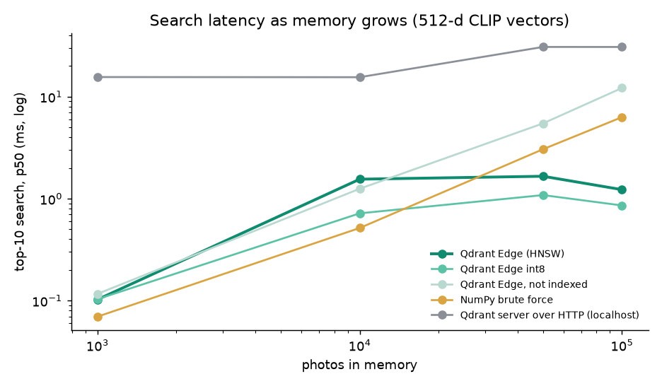
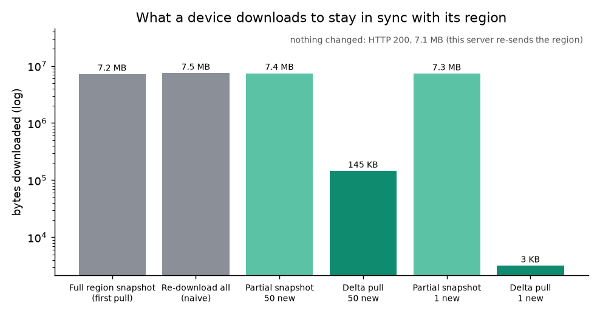
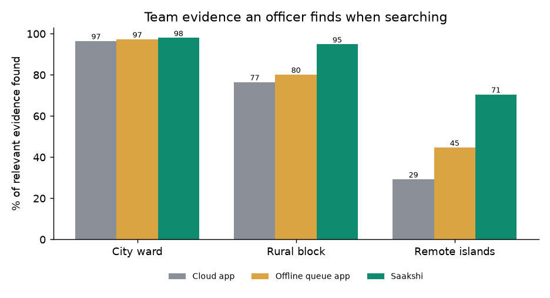
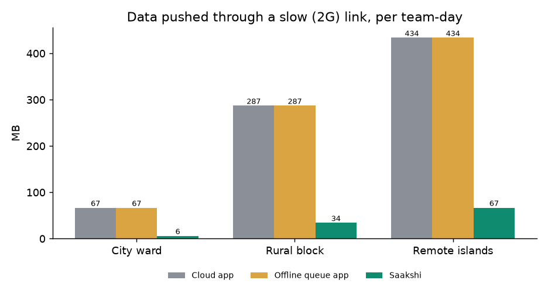

# Benchmarks

Three questions decide whether an edge memory is worth having:

1. **Is search on the device fast and accurate enough**, as memory grows, compared with simpler options and with asking a server?
2. **What does it cost to stay in sync** with the rest of the team over a poor link?
3. **Does it change what a field team can actually do** on a day when the network comes and goes?

Everything here is produced by the scripts in [`bench/`](../bench) and can be re-run:

```bash
# a standalone Qdrant (search over HTTP, global-layout sync) and a cluster-mode Qdrant (regional sync)
python -m bench.run_all --server http://127.0.0.1:6433 --cluster http://127.0.0.1:6333
# or, device-only and quick:  python -m bench.run_all --quick --skip-server
```

`bench.report` writes `docs/benchmarks/results.json` (read by the Benchmarks tab of the device app), the PNG charts in `docs/benchmarks/`, and **the tables on this page**, so the numbers in the text below are the numbers in the files. Each JSON file records its machine:

* **Search and the field day** (`search.json`, `fieldday.json`): a Windows 11 laptop, Intel, 8 logical CPUs, Python 3.12, with Qdrant 1.19.1 running natively on the same laptop for the server comparison.
* **Sync** (`sync.json`): run from the same laptop against a **Qdrant Cloud** cluster (Qdrant 1.19.1, cluster mode, one node), the server Saakshi deploys with; `sync.json` records the server's kind and version. Every byte crosses the internet, so the times include the network.
* [`sync_windows_server.json`](benchmarks/sync_windows_server.json) is kept as evidence: against a Qdrant server running natively on Windows, snapshots were 30 to 500 times larger (it puts its preallocated files into them in full), while point deltas were the same size.

<p align="center">
  
  
  
  
</p>

## Method

### 1. Search on the device

* **Data.** 512-d unit vectors shaped like CLIP photo embeddings: 300 clusters (scenes), points spread around them, so there are many near-neighbours, which is what makes approximate search hard. Notes are generated from the NGO vocabulary for BM25. Queries are perturbed copies of stored points; ground truth is exact top-10 by brute force.
* **Contenders** (same vectors, same queries): Qdrant Edge with our HNSW settings (`m=32`, `ef_construct=256`, `hnsw_ef=512`), Qdrant Edge with Qdrant's default HNSW settings, Qdrant Edge with int8 quantization, Qdrant Edge before `optimize()` (exact scan), NumPy brute force over a float32 matrix, and a Qdrant server over HTTP on **localhost** with the same HNSW settings (the best case for cloud search: no network in between).
* **Metrics.** p50/p95 latency of 200 queries, recall@10 against exact search, hybrid (dense + BM25 with RRF) latency, index build time, disk footprint.

### 2. Sync cost

A real Qdrant 1.19.1 server with 5 project regions of 2,000 points each (vectors + BM25 + payload). A device mirrors one region and we record what it downloads for: the first pull, a pull when nothing changed, one new photo, and 50 new photos per region (by delta pull and by partial snapshot), and the naive alternative of downloading the shard again. Both server layouts are measured: **regional** (cluster mode, custom sharding) and **global** (standalone, one shard). Partial snapshots are requested only after the server's optimizer has settled, as a device would see in practice.

### 3. A simulated field day

Four officers work one region for a 10-hour day, visiting sites and taking 4–9 photos per visit, with 30% retakes, 5% urgent notes, 10% damage reports and 25% of photos showing people (20% without recorded consent). Each officer has their own network trace (a Markov chain over good 4G, 2G and no signal) for three places: a city ward, a rural block, and remote islands. At the start of every site visit the officer searches for "what does the team already have here?".

The **same day** (photos, visits, network) is replayed for three approaches:

* **Cloud app**: uploads first-in-first-out at full resolution; search runs on the server.
* **Offline queue app**: the same upload queue, plus a local list of the officer's own captures; the team's evidence only online.
* **Saakshi**: the production policy function (`field/app/policy.py: decide()`) and the production thresholds (deferral, compression, 45-minute limit, delta vs snapshot), with delta and snapshot sizes taken from the sync benchmark.

What is real and what is assumed is spelled out in [`bench/bench_fieldday.py`](../bench/bench_fieldday.py); every assumption (link speeds, photo sizes, probabilities) is a named constant and is copied into `fieldday.json`. Uploads that are cut off by a lost connection restart from zero for every approach.

## Results

<!-- results:start -->

**Top-10 search: p50 latency in ms (recall@10)**

| Photos | Qdrant Edge, tuned HNSW | Qdrant Edge, default HNSW | Qdrant Edge, int8 | Qdrant Edge, not indexed | NumPy brute force | Qdrant server, HTTP, localhost |
|---:|---:|---:|---:|---:|---:|---:|
| 1,000 | 0.10 (1.000) | 0.12 (1.000) | 0.10 (1.000) | 0.12 (1.000) | 0.07 (1.000) | 15.57 (1.000) |
| 10,000 | 1.55 (1.000) | 0.28 (0.968) | 0.72 (0.970) | 1.25 (1.000) | 0.52 (1.000) | 15.52 (1.000) |
| 50,000 | 1.66 (0.995) | 0.31 (0.639) | 1.08 (0.936) | 5.47 (1.000) | 3.05 (1.000) | 30.72 (1.000) |
| 100,000 | 1.23 (0.985) | 0.27 (0.596) | 0.86 (0.891) | 12.16 (1.000) | 6.30 (1.000) | 30.70 (1.000) |

**Hybrid search (dense + BM25, RRF) on Qdrant Edge, and the device's disk footprint**

| Photos | hybrid p50 ms | hybrid p95 ms | index build s | disk MB (float32) | disk MB (+int8) |
|---:|---:|---:|---:|---:|---:|
| 1,000 | 0.18 | 0.21 | 0.1 | 5.4 | 5.4 |
| 10,000 | 1.69 | 1.94 | 2.84 | 52.0 | 57.2 |
| 50,000 | 2.40 | 3.82 | 23.11 | 258.7 | 284.5 |
| 100,000 | 2.23 | 2.60 | 56.49 | 517.1 | 568.6 |

**Speed vs accuracy at 100,000 photos (m=32, ef_construct=256)**

| hnsw_ef | p50 ms | p95 ms | recall@10 |
|---:|---:|---:|---:|
| 64 | 0.32 | 0.54 | 0.724 |
| 128 | 0.42 | 0.71 | 0.848 |
| 256 | 0.57 | 1.02 | 0.925 |
| 512 | 1.21 | 1.68 | 0.985 |
| 1024 | 2.21 | 2.74 | 0.995 |

**Regional layout** (cluster mode, one shard per project; the device serves 1 of 5 regions, 2,000 photos each) · server: Qdrant Cloud 1.19.1, cluster mode enabled

| Step | Downloaded | Time |
|---|---:|---:|
| First pull: full shard snapshot (2,000 points) | 7.2 MB | 10002 ms + 571 ms to open |
| Nothing changed: partial snapshot request | 7.1 MB (HTTP 200) | 4582 ms |
| 1 new point: delta pull (filtered scroll) | 3 KB | 1187 ms |
| 1 new point: partial snapshot | 7.3 MB | 4205 ms |
| 50 new points per region: delta pull | 145 KB | 2108 ms |
| 50 new points per region: partial snapshot | 7.4 MB | 5580 ms + 1723 ms to apply |
| Naive: download the shard again | 7.5 MB | 4171 ms |

**Global layout** (one shard for every project, as on a standalone server; 5 projects × 2,000 photos) · server: Qdrant Cloud 1.19.1, cluster mode enabled

| Step | Downloaded | Time |
|---|---:|---:|
| First pull: full shard snapshot (10,000 points) | 29.4 MB | 8556 ms + 579 ms to open |
| Nothing changed: partial snapshot request | 29.1 MB (HTTP 200) | 11815 ms |
| 1 new point: delta pull (filtered scroll) | 3 KB | 1295 ms |
| 1 new point: partial snapshot | 29.3 MB | 6258 ms |
| 50 new points per region: delta pull | 722 KB | 5357 ms |
| 50 new points per region: partial snapshot | 29.9 MB | 6388 ms + 1573 ms to apply |
| Naive: download the shard again | 30.2 MB | 6430 ms |

**City ward (Kolkata)** · link: good 85%, slow 12%, offline 3% · 30 simulated days, 190 photos per team-day

| Metric | Cloud app | Offline queue app | Saakshi |
|---|---:|---:|---:|
| Searches answered (%) | 97.2 | 100 | 100 |
| Team's relevant evidence found (%) | 96.5 | 97.3 | 98.0 |
| Search latency p50 (ms) | 680 | 680 | 26.7 |
| Urgent photo at HQ, p50 (min) | 0.0 | 0.0 | 0.0 |
| Urgent photo at HQ, p90 (min) | 1.0 | 1.0 | 0.0 |
| Urgent photos at HQ same day (%) | 99.6 | 99.6 | 99.6 |
| All photos at HQ same day (%) | 99.4 | 99.4 | 98.9 |
| Uploaded per team-day (MB) | 615 | 615 | 383 |
| …of which over 2G (MB) | 66.7 | 66.7 | 6.0 |
| Downloaded per team-day (MB) | 0.0 | 0.0 | 844 |
| Wasted by dropped uploads (MB) | 0.1 | 0.1 | 0.1 |
| Unblurred faces uploaded per team-day | 36.8 | 36.8 | 0.0 |
| Repeat shots uploaded per team-day | 43.7 | 43.7 | 0.0 |

**Rural block** · link: good 35%, slow 40%, offline 25% · 30 simulated days, 190 photos per team-day

| Metric | Cloud app | Offline queue app | Saakshi |
|---|---:|---:|---:|
| Searches answered (%) | 78.1 | 100 | 100 |
| Team's relevant evidence found (%) | 76.5 | 80.2 | 94.9 |
| Search latency p50 (ms) | 7,150 | 680 | 26.7 |
| Urgent photo at HQ, p50 (min) | 2.0 | 2.0 | 1.0 |
| Urgent photo at HQ, p90 (min) | 28.8 | 28.8 | 24.0 |
| Urgent photos at HQ same day (%) | 99.6 | 99.6 | 99.6 |
| All photos at HQ same day (%) | 98.7 | 98.7 | 97.4 |
| Uploaded per team-day (MB) | 614 | 614 | 327 |
| …of which over 2G (MB) | 287 | 287 | 34.2 |
| Downloaded per team-day (MB) | 0.0 | 0.0 | 477 |
| Wasted by dropped uploads (MB) | 4.5 | 4.5 | 0.5 |
| Unblurred faces uploaded per team-day | 36.7 | 36.7 | 0.0 |
| Repeat shots uploaded per team-day | 43.2 | 43.2 | 0.0 |

**Remote islands (Sundarbans)** · link: good 5%, slow 30%, offline 65% · 30 simulated days, 190 photos per team-day

| Metric | Cloud app | Offline queue app | Saakshi |
|---|---:|---:|---:|
| Searches answered (%) | 37.1 | 100 | 100 |
| Team's relevant evidence found (%) | 29.3 | 44.7 | 70.5 |
| Search latency p50 (ms) | 7,150 | 26.7 | 26.7 |
| Urgent photo at HQ, p50 (min) | 32.5 | 32.5 | 20.5 |
| Urgent photo at HQ, p90 (min) | 189 | 189 | 110 |
| Urgent photos at HQ same day (%) | 87.7 | 87.7 | 91.1 |
| All photos at HQ same day (%) | 86.5 | 86.5 | 86.5 |
| Uploaded per team-day (MB) | 543 | 543 | 149 |
| …of which over 2G (MB) | 434 | 434 | 66.9 |
| Downloaded per team-day (MB) | 0.0 | 0.0 | 169 |
| Wasted by dropped uploads (MB) | 10.0 | 10.0 | 0.5 |
| Unblurred faces uploaded per team-day | 32.1 | 32.1 | 0.0 |
| Repeat shots uploaded per team-day | 37.3 | 37.3 | 0.0 |

<!-- results:end -->

## What the numbers say, and what they do not

**Search.**
* For **small memories (up to 10,000 photos) NumPy brute force is the fastest option**: 0.5 ms at 10,000 against 1.6 ms for the index. If search speed were the only goal, a matrix would do.
* As memory grows, brute force grows with it (6.3 ms at 100,000 photos on the laptop) while the HNSW index stays under 2 ms (1.2 ms at 100,000).
* **Qdrant's default HNSW settings are not good enough for this data**: at 100,000 clustered photo vectors, recall@10 drops to 0.60. The denser graph (`m=32`, `ef_construct=256`) with `hnsw_ef=512` keeps recall at 0.985–1.0 across all sizes. We use those settings on the device and on the server (the server's shard *is* the device's mirror).
* The server over HTTP on the same laptop takes 15–31 ms: already slower than the device, before a single metre of real network, and unavailable offline. It already takes 15.6 ms at 1,000 photos, so most of it is a fixed cost per request on this machine rather than search; either way it is the best case for a server, with no network in between.

**Sync.**
* A region costs a device about a quarter of the whole collection (5 regions).
* One new photo costs about **3 KB by delta pull**. On Qdrant Cloud a partial snapshot re-sends the whole region (7.3 MB), and a request with an unchanged manifest re-sends it too (7.1 MB) instead of answering 304. That is why the device first asks the server how many points changed: nothing is downloaded when nothing changed, and up to 100 changes travel as points; snapshots run for the first pull and periodically to reconcile deletions.
* 50 new photos in the device's region: 145 KB by delta pull, 7.4 MB by partial snapshot on Qdrant Cloud.

**Field day.**
* In the city the three approaches are close: good networks make most designs work.
* The gap opens as the network gets worse. On the remote islands the cloud app answers about a third of searches; Saakshi answers all of them, and finds most of the team's evidence because vectors (a few KB) reach the server within minutes and mirrors refresh cheaply.
* Saakshi pushes a fraction of the data over 2G (routine photos wait or go compressed, repeats are linked), delivers urgent photos sooner, and never uploads an unblurred face.
* The cost: downloads. With Qdrant Cloud's sizes (a partial snapshot re-sends the whole region), keeping four officers' mirrors fresh takes 844 MB per team-day in the city, 477 MB in the rural block and 169 MB on the islands, mostly from the reconcile snapshot every 15 minutes on good links. It is the price of searching the team's evidence offline, and it is paid mostly on good links.
* This is a simulation. The network mixes, photo sizes and visit patterns are assumptions; change them in `bench/bench_fieldday.py` and re-run.
